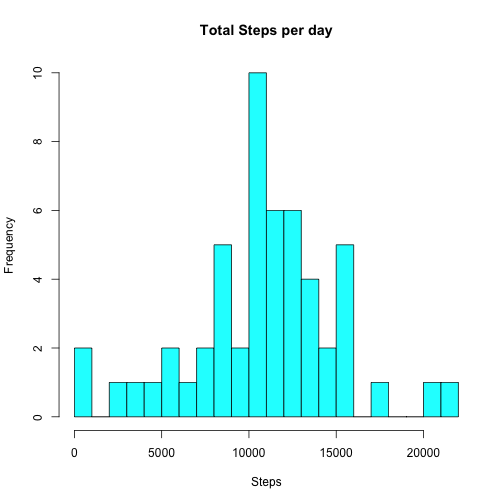
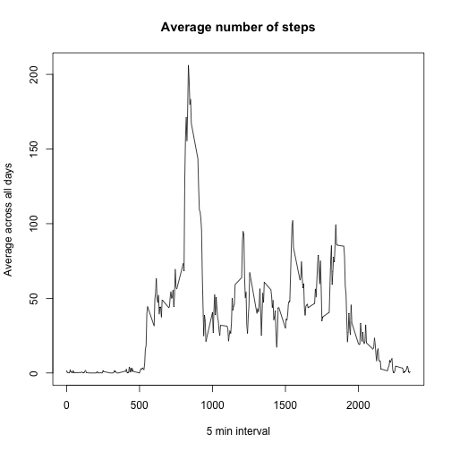
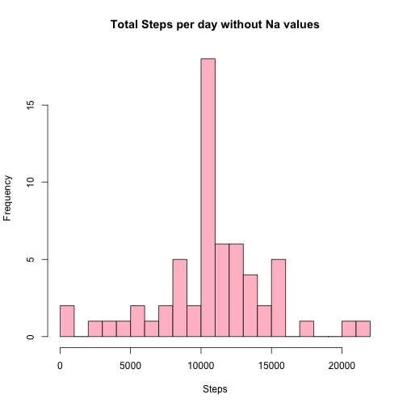
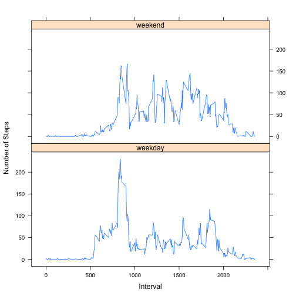

This assignment is divided in steps, and the data analyzed was collected by an "activity monitoring device"  
during the months of October and November, 2012.  

## Loading and preprocessing the data  

Loading data and converting date to date type.


```r
activity <- read.csv("activity.csv", colClasses = c("numeric", "character", "numeric"))
activity$date <- as.Date(activity$date)
head(activity)
```

```
##   steps       date interval
## 1    NA 2012-10-01        0
## 2    NA 2012-10-01        5
## 3    NA 2012-10-01       10
## 4    NA 2012-10-01       15
## 5    NA 2012-10-01       20
## 6    NA 2012-10-01       25
```

## What is mean total number of steps taken per day?  

- Because the data has NA values, I will omit them.


```r
act_1 <- na.omit(activity)
head(act_1)
```

```
##     steps       date interval
## 289     0 2012-10-02        0
## 290     0 2012-10-02        5
## 291     0 2012-10-02       10
## 292     0 2012-10-02       15
## 293     0 2012-10-02       20
## 294     0 2012-10-02       25
```

- Calculating the total number of steps taken per day.


```r
Total_steps <- aggregate(steps ~ date, act_1, sum)
colnames(Total_steps) <- c("Date","Steps")
head(Total_steps)
```

```
##         Date Steps
## 1 2012-10-02   126
## 2 2012-10-03 11352
## 3 2012-10-04 12116
## 4 2012-10-05 13294
## 5 2012-10-06 15420
## 6 2012-10-07 11015
```

- Making a histogram of the total number of steps taken each day.


```r
hist(Total_steps$Steps, main= "Total Steps per day", xlab="Steps",
     breaks= 20, col= "cyan")
```

 

- Calculate and report the mean and median of the total number of steps taken per day.

```r
Steps_mean <- mean(Total_steps$Steps); Steps_mean
```

```
## [1] 10766.19
```

```r
Steps_median <- median(Total_steps$Steps); Steps_median
```

```
## [1] 10765
```

## What is the average daily activity pattern?

- Calculating the average.


```r
int_av <- aggregate(steps ~ interval, data = act_1, FUN = mean)
```

- Plotting


```r
plot(int_av, type = "l", xlab = "5 min interval",
     ylab = "Average across all days", main = "Average number of steps")
```

 

- Which interval, on average across all the days, has the max number of steps?


```r
max_int <- int_av[which.max(int_av$steps),]; max_int
```

```
##     interval    steps
## 104      835 206.1698
```

So the 835th interval is the one with most steps with 206 steps.


## Imputing missing values

- Calculating the total number of missing values in the data set.


```r
sum(is.na(activity))
```

```
## [1] 2304
```

- Replacing the missing values by the mean of the 5 min interval .


```r
act_2 <- transform(activity, steps = ifelse(is.na(activity$steps), 
      int_av$steps[match(activity$interval, int_av$interval)], activity$steps))

head(act_2)
```

```
##       steps       date interval
## 1 1.7169811 2012-10-01        0
## 2 0.3396226 2012-10-01        5
## 3 0.1320755 2012-10-01       10
## 4 0.1509434 2012-10-01       15
## 5 0.0754717 2012-10-01       20
## 6 2.0943396 2012-10-01       25
```

```r
sum(is.na(act_2))
```

```
## [1] 0
```

- So no Na values remain on the new data set

- Calculating the new total number of steps and making the new histogram.


```r
Total_steps_1 <- aggregate(steps ~ date, act_2, sum)
colnames(Total_steps_1) <- c("Date","Steps")
head(Total_steps_1)
```

```
##         Date    Steps
## 1 2012-10-01 10766.19
## 2 2012-10-02   126.00
## 3 2012-10-03 11352.00
## 4 2012-10-04 12116.00
## 5 2012-10-05 13294.00
## 6 2012-10-06 15420.00
```

```r
hist(Total_steps_1$Steps, main= "Total Steps per day without Na values", 
     xlab="Steps", breaks= 20, col= "pink")
```

 

- Calculating the new mean and median for the data set with filled missing values.


```r
Steps_mean_1 <-mean(Total_steps_1$Steps); Steps_mean_1
```

```
## [1] 10766.19
```

```r
Steps_median_1 <- median(Total_steps_1$Steps); Steps_median_1
```

```
## [1] 10766.19
```

- Comparing the new and old mean/median.


```r
mean_diff <- Steps_mean_1 - Steps_mean ; mean_diff
```

```
## [1] 0
```

```r
median_diff <- Steps_median_1 - Steps_median ; median_diff
```

```
## [1] 1.188679
```

- The mean has not changed, but the new median is slightly bigger than the old one. 

## Are there differences in activity patterns between weekdays and weekends?

- I'm going to use the act_2 data set with filled missing values.

- First I'll be using the weekdays function to create a new variable in the data frame.


```r
act_2$weekdays <- factor(format(act_2$date, "%A"))
levels(act_2$weekdays)
```

```
## [1] "Friday"    "Monday"    "Saturday"  "Sunday"    "Thursday"  "Tuesday"  
## [7] "Wednesday"
```

- And separating the days in weekday and weekend.


```r
levels(act_2$weekdays) <- list(weekday = c("Monday","Tuesday","Wednesday",
                              "Thursday","Friday"), weekend = c("Saturday","Sunday"))
levels(act_2$weekdays)
```

```
## [1] "weekday" "weekend"
```

```r
table(act_2$weekdays)
```

```
## 
## weekday weekend 
##   12960    4608
```

- Calculating the average of steps in both weekday and weekend periods.


```r
av_steps <- aggregate(act_2$steps,
                      list(interval = act_2$interval, weekdays = act_2$weekdays), 
                      FUN = "mean")
names(av_steps)[3] <- "mean"
head(av_steps)
```

```
##   interval weekdays       mean
## 1        0  weekday 2.25115304
## 2        5  weekday 0.44528302
## 3       10  weekday 0.17316562
## 4       15  weekday 0.19790356
## 5       20  weekday 0.09895178
## 6       25  weekday 1.59035639
```

- Changing

- Plotting the average of steps


```r
library(lattice)
xyplot(av_steps$mean ~ av_steps$interval | av_steps$weekdays,
       layout= c(1,2), type = "l",
       xlab= "Interval", ylab = "Number of Steps")
```

 

- Is evident on the plot that the activity on the weekend is different that on weekday,  
generally speaking the activity on the weekend is bigger than on the weekday.
